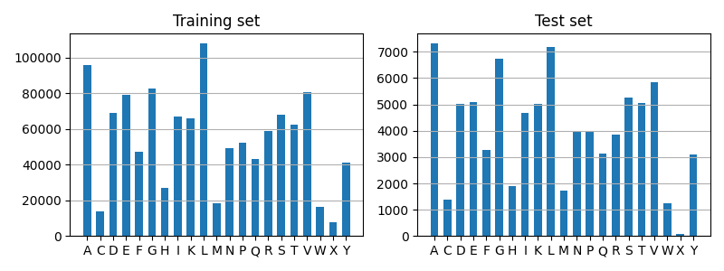
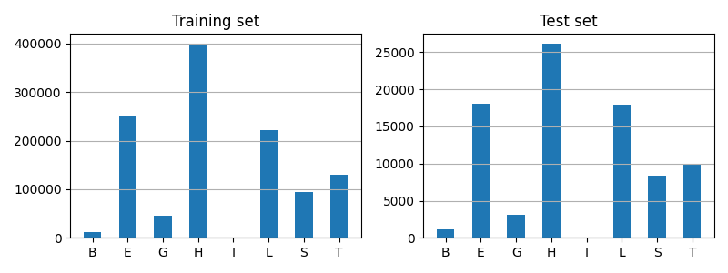

# Datasets for Protein Secondary Structure Prediction

## Introduction

Protein secondary structure prediction datasets, CullPDB5926 and CB513, and the simple implementation in PyTorch.

## Datasets

Here, we introduce the datasets for protein secondary structure prediction used in the paper at ICML 2014[^ICML2014].

As described in the paper two datasets are used. Both are based on protein structures from CullPDB servers. The difference is that the first one is divided to training/validation/test set, while the second one is filtered to remove redundancy with CB513 dataset (for the purpose of testing performance on CB513 dataset).

`cullpdb+profile_5926_filtered.npy.gz` is the one with training/validation/test set division, after filtering for redundancy with CB513. this is used for evaluation on CB513.

`cb513+profile_split1.npy.gz` is the CB513 including protein features. Note that one of the sequences in CB513 is longer than 700 amino acids, and it is splited to two overlapping sequences and these are the last two samples (i.e. there are 514 rows instead of 513).

It is currently in numpy format as a (N protein x k features) matrix. You can reshape it to (N protein x 700 amino acids x 57 features) first.

The 57 features are:
- `[0,22)`: amino acid residues, with the order of 'A', 'C', 'E', 'D', 'G', 'F', 'I', 'H', 'K', 'M', 'L', 'N', 'Q', 'P', 'S', 'R', 'T', 'W', 'V', 'Y', 'X', 'NoSeq'
- `[22,31)`: Secondary structure labels, with the sequence of 'L', 'B', 'E', 'G', 'I', 'H', 'S', 'T', 'NoSeq'
- `[31,33)`: N- and C- terminals;
- `[33,35)`: Relative and absolute solvent accessibility, used only for training. (absolute accessibility is thresholded at 15; relative accessibility is normalized by the largest accessibility value in a protein and thresholded at 0.15; original solvent accessibility is computed by DSSP)
- `[35,57)`: Sequence profile. Note the order of amino acid residues is ACDEFGHIKLMNPQRSTVWXY and it is different from the order for amino acid residues

The last feature of both amino acid residues and secondary structure labels just mark end of the protein sequence.
`[22,31)` and `[33,35)` are hidden during testing.

The `cullpdb+profile_5926_filtered.npy.gz` file are removed duplicates from the original `cullpdb+profile_6133_filtered.npy.gz` file, updated 2018-10-28.

The dataset division for the `cullpdb+profile_5926.npy.gz` file is

- `[0,5430)` training
- `[5435,5690)` test
- `[5690,5926)` validation

For the filtered dataset `cullpdb+profile_5926_filtered.npy.gz`, all proteins can be used for training and test on CB513 dataset.

**Sequence length.**

**Amino acid residues.**

**Secondary structures.**

[^ICML2014]: [*Deep supervised and convolutional generative stochastic network for protein secondary structure prediction*](http://www.princeton.edu/~jzthree/datasets/ICML2014/), **ICML**, 2014.
[^GitHub]: [takatex/protein-secondary-structure-prediction](https://github.com/takatex/protein-secondary-structure-prediction)
[^PaperWithCode]: [Protein Secondary Structure Prediction on CB513](https://paperswithcode.com/sota/protein-secondary-structure-prediction-on-1)
